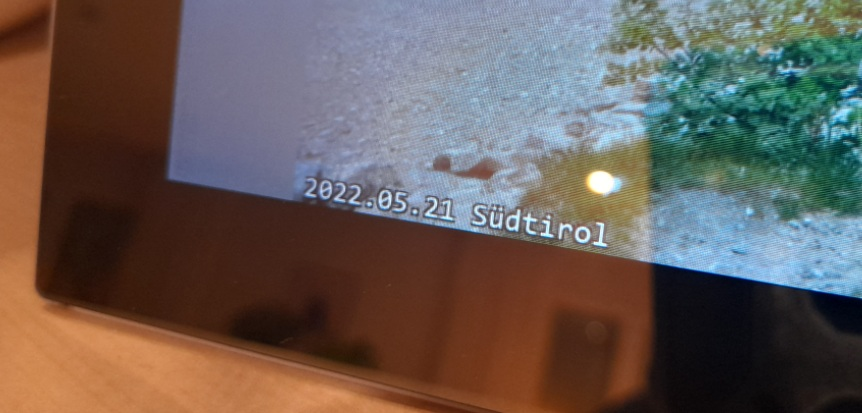
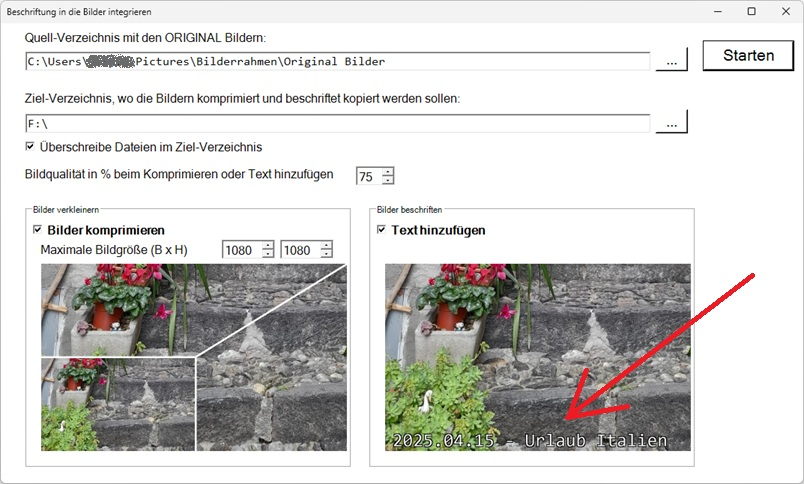

# PrintTextToPicture

Falls du auch einen elektronischer Bilderrahmen hast und dich ständig fragst,
wann und wo das Bild aufgenommen wurde, dann ist diese Software
genau das Richtige für dich.

Bild 1: Elektronischer Bilderrahmen

Bild 2: Text im Bilderrahmen

Bild 3: Softwareoberfläche

## Funktionsweise:

Die JPG Bilder befinden sich in beschrifteten Ordnern auf dem USB-Stick,
das du in den Bilderrahmen einsteckst.

Beispielhaft SD-Karten Inhalt

    E:/
       ├── 2025.04.15 - Urlaub Italien
       │   ├── 20250115_101500.jpg
       │   ├── 20250115_101501.jpg
       │   └── 20250115_101502.jpg
       │
       ├── 2025.05.20 - Geburtstag Anna
       │   ├── 20250220_141200.jpg
       │   └── 20250220_141201.jpg
       │
       ├── 2025.06.10 -Wanderung Alpen
       │   ├── 20250310_090000.jpg
       │   ├── 20250310_090001.jpg
       │   └── 20250310_090002.jpg
       │
       └── 2025.08.05 - Stadtbesichtigung Rom
           ├── 20250405_110000.jpg
           ├── 20250405_110001.jpg 
           └── 20250405_110002.jpg

Mit der Software kannst du die Ordner der Bilder auswählen (in diesem Fall E:/).
Danach wird in jedem Bild der Name des Ordners eingefügt.

Beispielhaft wird im Bild "20250115_101500.jpg" der Text "2025.04.15 - Urlaub Italien" eingefügt.

**ACHTUNG**: Die Originalbilder werden geändert. Bitte vorher sichern!

**WICHTIG**: Die Software funktioniert nur z.Z. mit JPG Bildern (also nicht mit PNG, JPEG oder GIF Dateien).

## Zusatzfunktion:

Da mein Bilderrahmen nur SD Karten mit 4 GByte unterstützt, habe ich eine
Zusatzfunktion eingebaut, die die Bilder in der Auflösung verkleinert.

